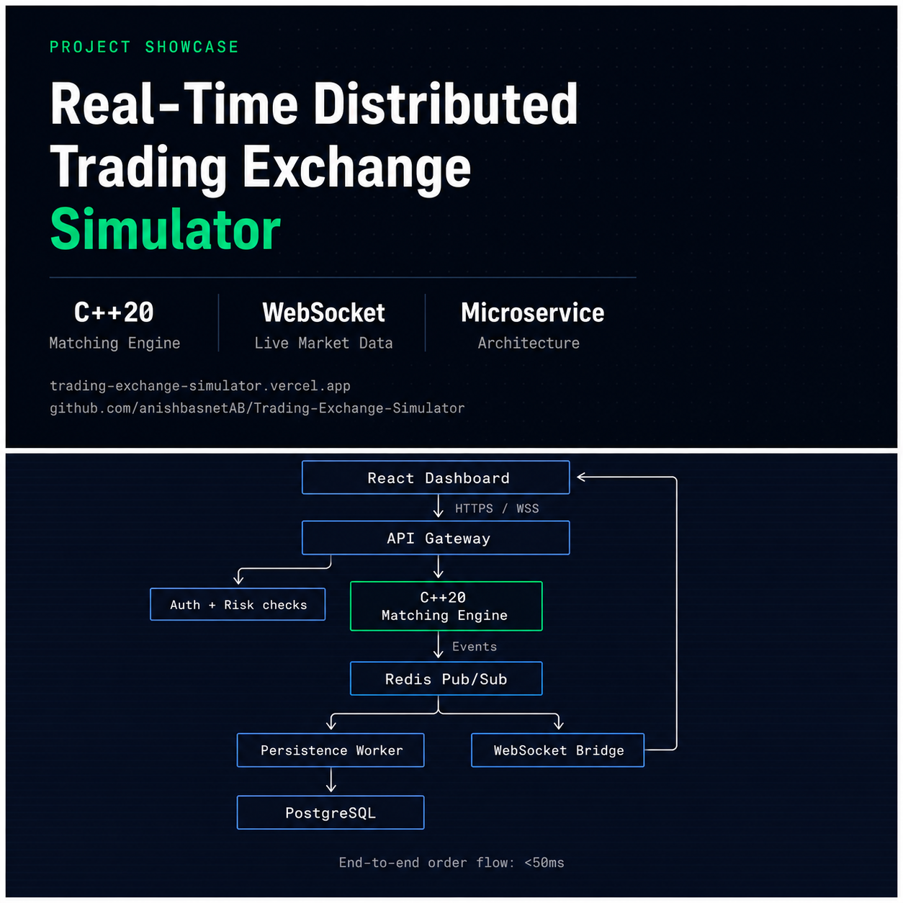

# Real-Time Distributed Trading Exchange Simulator

A production-grade trading exchange simulator featuring a C++20 matching engine,
microservice architecture, JWT authentication, Redis event streaming, and live
WebSocket market data.

live: https://trading-exchange-simulator.vercel.app




**Order flow:** `React → API Gateway → Risk Checks → C++20 Matching Engine → Redis Pub/Sub → Persistence Worker + WebSocket Bridge → PostgreSQL / Browser`

---

## Architecture

```
                          React Dashboard
                                |
                           HTTPS / WSS
                                |
                          API Gateway
                         /     |      \
                    Auth    Orders   Account
                                |
                          Risk Service
                                |
                   C++20 Matching Engine
                                |
                         Redis Pub/Sub
                        /              \
            Persistence Worker    WebSocket Bridge
                    |                    |
               PostgreSQL          React Dashboard
```

---

## Tech Stack

| Layer            | Technology                              |
|------------------|-----------------------------------------|
| Frontend         | React 18 + TypeScript + Tailwind CSS    |
| API Gateway      | Node.js + Fastify + TypeScript + Zod    |
| Matching Engine  | C++20 + CMake + GoogleTest              |
| Database         | PostgreSQL 16                           |
| Event Bus        | Redis 7 Pub/Sub                         |
| Auth             | JWT + Refresh Tokens + bcrypt           |
| Containerization | Docker + Docker Compose                 |
| CI               | GitHub Actions                          |

---

## Performance

| Metric                              | Value                                      |
|-------------------------------------|--------------------------------------------|
| Matching algorithm complexity       | O(log n) per order — std::map price levels |
| Price-time priority                 | std::deque FIFO per price level            |
| Lock contention                     | None — single-threaded deterministic loop  |
| End-to-end order flow latency       | < 50ms (place order → WebSocket push)      |
| API average response time           | ~5ms (measured in Railway deploy logs)     |
| Trade persistence                   | Atomic 3-write PostgreSQL transaction      |
| Unit tests                          | 11 passing (OrderBook + MatchingEngine)    |

The matching engine is single-threaded by design. Matching is an inherently serial operation — determinism and correctness take priority over parallelism. The engine never blocks on I/O; all database writes happen asynchronously downstream via Redis consumers.

---

## Architecture and Design Decisions

**Matching engine is process-isolated.**
The C++ engine runs as a child process communicating over stdin/stdout using JSON. It has no knowledge of the database, Redis, or HTTP. Business logic lives in the application layer, not the engine. This makes the engine independently testable and replaceable without touching any other service.

**Engine never writes to the database.**
The engine emits events outward. A Redis consumer handles persistence asynchronously. Database latency never affects matching throughput. The tradeoff is at-most-once delivery — if the process crashes between event emission and Redis receipt, that event is lost. This is acceptable for a simulator; a production system would use a write-ahead log.

**Two-token authentication.**
Short-lived access tokens (15 min) are stateless — verified by cryptographic signature with no database lookup. Long-lived refresh tokens (7 days) are stored as bcrypt hashes in PostgreSQL, enabling revocation. A stolen access token has a 15-minute window. Logout is immediate — the refresh token is marked revoked in the database.

**NUMERIC not FLOAT for all financial values.**
IEEE 754 floating point cannot represent most decimal fractions exactly. `0.1 + 0.2` evaluates to `0.30000000000000004`. Every price, quantity, balance, and PnL value uses PostgreSQL `NUMERIC(18,8)` — exact decimal arithmetic. The Node.js `pg` driver returns these as strings; they are parsed only at the display boundary.

**Atomic trade persistence.**
Trade record, buyer position update, and seller position update run inside a single PostgreSQL transaction. All three succeed or all three roll back. There is no state where a trade is recorded but positions are not updated.

**C++ compiled inside Docker at build time.**
Mac compiles ARM binaries. Railway runs Linux x86. A locally compiled binary fails at spawn with a cryptic architecture error. The Dockerfile compiles the engine inside the Linux container, ensuring the binary always matches the runtime environment.

---

## Getting Started

```bash
# Clone the repository
git clone https://github.com/anishbasnetAB/Trading-Exchange-Simulator.git
cd trading-exchange-simulator

# Copy environment file and fill in values
cp .env.example .env

# Start all services
docker compose up --build

# Frontend:   http://localhost:3000
# API:        http://localhost:4000
# Health:     http://localhost:4000/health
```

---

## How to Run

### Place a trade end to end

```bash
# Register two users
curl -X POST http://localhost:4000/auth/register \
  -H "Content-Type: application/json" \
  -d '{"email": "buyer@example.com", "password": "Password123"}'

curl -X POST http://localhost:4000/auth/register \
  -H "Content-Type: application/json" \
  -d '{"email": "seller@example.com", "password": "Password123"}'

# Get tokens
TOKEN_BUYER=$(curl -s -X POST http://localhost:4000/auth/login \
  -H "Content-Type: application/json" \
  -d '{"email": "buyer@example.com", "password": "Password123"}' \
  | grep -o '"accessToken":"[^"]*"' | cut -d'"' -f4)

TOKEN_SELLER=$(curl -s -X POST http://localhost:4000/auth/login \
  -H "Content-Type: application/json" \
  -d '{"email": "seller@example.com", "password": "Password123"}' \
  | grep -o '"accessToken":"[^"]*"' | cut -d'"' -f4)

# Place opposing orders — these will match
curl -X POST http://localhost:4000/orders \
  -H "Content-Type: application/json" \
  -H "Authorization: Bearer $TOKEN_SELLER" \
  -d '{"symbol":"AAPL","side":"SELL","type":"LIMIT","price":150,"quantity":10}'

curl -X POST http://localhost:4000/orders \
  -H "Content-Type: application/json" \
  -H "Authorization: Bearer $TOKEN_BUYER" \
  -d '{"symbol":"AAPL","side":"BUY","type":"LIMIT","price":150,"quantity":10}'

# Verify trade persisted
docker exec -it exchange_postgres psql -U exchange_user -d trading_exchange \
  -c "SELECT symbol, price, quantity, executed_at FROM trades ORDER BY executed_at DESC LIMIT 5;"
```

### Connect to WebSocket

```bash
npm install -g wscat

TOKEN=$(curl -s -X POST http://localhost:4000/auth/login \
  -H "Content-Type: application/json" \
  -d '{"email": "buyer@example.com", "password": "Password123"}' \
  | grep -o '"accessToken":"[^"]*"' | cut -d'"' -f4)

wscat -c "ws://localhost:4000/ws?token=$TOKEN"
```

After connecting, subscribe:
```json
{"type":"SUBSCRIBE","channels":["public:trades:AAPL","private:orders"]}
```

### Run C++ tests

```bash
cd engine/matching-engine-cpp
mkdir -p build && cd build
cmake ..
make
./engine_tests
```

### Run TypeScript typecheck

```bash
cd services/api-gateway && npx tsc --noEmit
cd frontend && npx tsc --noEmit
```

---

## API Reference

All endpoints except `/auth/*` and `/health` require `Authorization: Bearer <token>`.

| Method | Endpoint           | Auth | Description                        |
|--------|--------------------|------|------------------------------------|
| POST   | /auth/register     | No   | Create account                     |
| POST   | /auth/login        | No   | Login, receive access + refresh token |
| POST   | /auth/refresh      | No   | Exchange refresh cookie for new access token |
| POST   | /auth/logout       | Yes  | Revoke refresh token               |
| GET    | /health            | No   | Liveness probe                     |
| GET    | /account/me        | Yes  | Cash balance and account status    |
| GET    | /account/positions | Yes  | Open positions with PnL            |
| POST   | /orders            | Yes  | Place a new order                  |
| GET    | /orders            | Yes  | Order history                      |
| DELETE | /orders/:id        | Yes  | Cancel an open order               |
| GET    | /trades/:symbol    | Yes  | Last 50 trades for a symbol        |
| GET    | /orderbook/:symbol | Yes  | Current order book depth           |

---

## Project Structure

```
trading-exchange-simulator/
├── engine/
│   └── matching-engine-cpp/     # C++20 matching engine
│       ├── include/             # Order.h, OrderBook.h, MatchingEngine.h
│       ├── src/                 # Implementations + JSON I/O main.cpp
│       └── tests/               # 11 GoogleTest unit tests
├── frontend/                    # React 18 trading dashboard
├── services/
│   └── api-gateway/             # All backend logic
│       └── src/
│           ├── db/              # PostgreSQL query functions
│           ├── middleware/      # JWT authentication
│           ├── routes/          # auth, orders, trades, ws, orderbook
│           ├── services/        # engine, redis, risk, ws-manager
│           └── workers/         # persistence worker
├── infra/
│   └── postgres/                # SQL schema migration
├── images/                      # README and social assets
├── docs/                        # Extended documentation
├── docker-compose.yml
├── railway.toml
└── .env.example
```

---

## Environment Variables

| Variable               | Description                           | Required |
|------------------------|---------------------------------------|----------|
| POSTGRES_USER          | PostgreSQL username                   | Yes      |
| POSTGRES_PASSWORD      | PostgreSQL password                   | Yes      |
| POSTGRES_DB            | PostgreSQL database name              | Yes      |
| REDIS_PASSWORD         | Redis auth password                   | Yes      |
| JWT_ACCESS_SECRET      | Secret for signing access tokens (min 32 chars) | Yes |
| JWT_REFRESH_SECRET     | Secret for signing refresh tokens (min 32 chars) | Yes |
| NODE_ENV               | Runtime environment                   | No       |

---

## Development

```bash
# View logs
docker compose logs -f api-gateway

# Rebuild a single service
docker compose up --build api-gateway

# Full clean rebuild
docker compose build --no-cache && docker compose up

# Access PostgreSQL directly
docker exec -it exchange_postgres psql -U exchange_user -d trading_exchange
```

---

## Deployment

Backend (API + PostgreSQL + Redis) is deployed on Railway. Frontend is deployed on Vercel.

Live: [trading-exchange-simulator.vercel.app](https://trading-exchange-simulator.vercel.app)

---

## License

MIT
